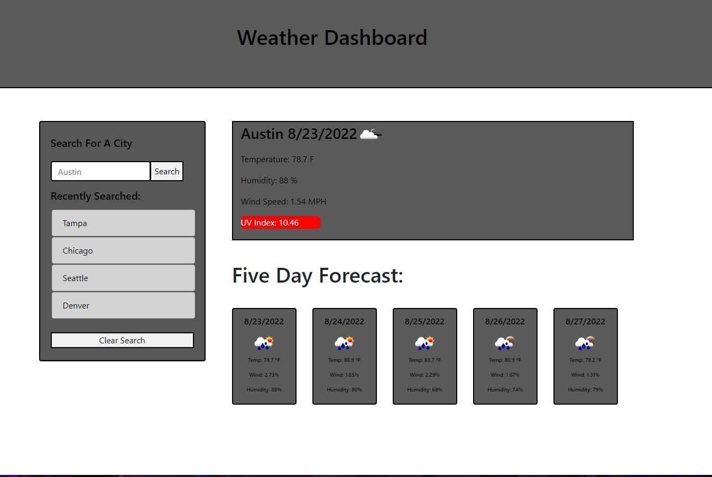

# 06 Server Side APIs:  Weather_Dashboard

* This application allows you to search for the weather in any city.
* The application uses data from the OpenWeather API 
* Click link below to see deployed App

https://laurencvengros.github.io/Weather_Dashboard/

# Functionality 

* IF you type a city into the search bar
    THEN you will be presented with the current weather conditions including:
    current temperature, humidity, wind speed and uv index as well as the future weather conditions for the next 5 days.

* IF you reload the page
    THEN past searches will save and be displayed in your search history.

* IF you click on a recent search
    THEN you will be presented with that weather again.

* IF you click the clear search button
  THEN your recent seqarches will be deleted.

# Screenshot of Website

